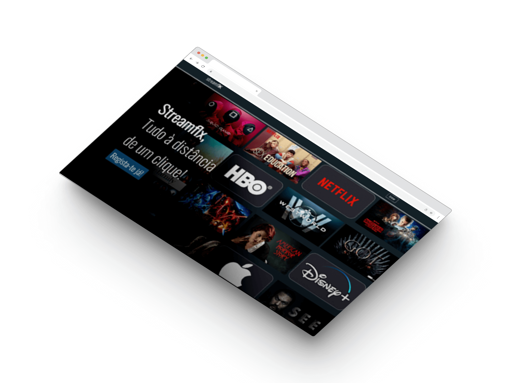

# Streamflix



## Academic Project

## Description

Project to **"Programming II"** curricular unit of my degree: Platform to manage your favorite movies and TV shows.

## Technologies Used

- HTML
- CSS
- JavaScript
- EJS
- Node.js
- Express.js
- API Integration ([TMDB] (https://www.themoviedb.org/))


## Features and Functionality

- Application with CRUD 
- MVC Structure
- Relational Databases (MySQL)

## Usage Instructions

This application is not available for installation as it was developed only for portfolio purposes. However, you can clone this repository and run the application locally using the following steps:

```bash
# Clone the repository
git clone https://github.com/nandodani/streamflix.git

# Navigate to the project folder
cd streamflix

# Install dependencies
npm install

# Start the application
npm start
```
## Contact
Name: Fernando Apóstolo \
Email: fernandodaniel.work@gmail.com \
LinkedIn: https://www.linkedin.com/in/fernando-apostolo \
Website: https://www.nandodani.github.io 
